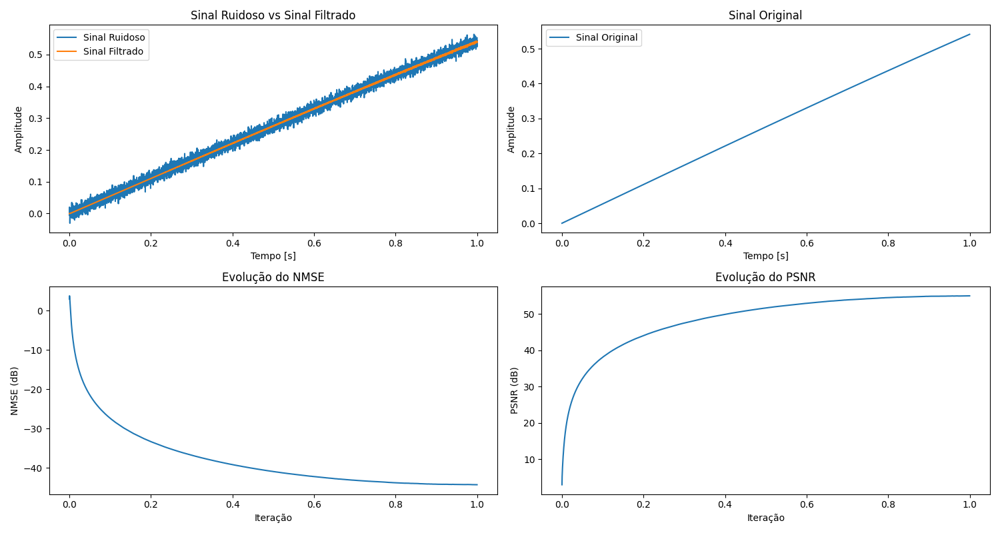

### README.md

# Algoritmo KFLMS para Filtragem de Sinais

Este projeto implementa o algoritmo KFLMS (Kernel Filtered Least Mean Squares) para a filtragem de sinais ruidosos. A implementação inclui uma função de kernel gaussiano, a classe do filtro KFLMS, e a avaliação de desempenho usando métricas NMSE e PSNR.

## Descrição do Algoritmo

O **KFLMS** é um algoritmo de filtragem que utiliza uma função de kernel para mapear os dados de entrada para um espaço de características de alta dimensão, onde é realizada a filtragem. O kernel gaussiano (ou RBF) é utilizado nesta implementação.

### Kernel Gaussiano (RBF)

A função de kernel gaussiano é definida como:

```math
K(x_1, x_2) = \exp\left(-\frac{\|x_1 - x_2\|^2}{2\sigma^2}\right)
```

onde $x_1$ e $x_2$ são os vetores de entrada e $\sigma$ é o parâmetro de dispersão do kernel.

```python
# Função de kernel gaussiano (RBF)
def gaussian_kernel(x1, x2, sigma=1.0):
    return np.exp(-np.linalg.norm(np.array(x1) - np.array(x2)) ** 2 / (2 * sigma ** 2))
```

### Classe KFLMS

A classe KFLMS implementa o filtro adaptativo com kernel gaussiano.

#### Inicialização dos Parâmetros

Os parâmetros do filtro são inicializados no método `__init__`, incluindo o tamanho da entrada, a função de kernel, o passo de atualização, e o parâmetro sigma.

```python
# Classe do algoritmo KFLMS
class KFLMS:
    def __init__(self, input_size, kernel_func, step_size=0.1, sigma=1.0):
        self.input_size = input_size
        self.kernel_func = kernel_func
        self.step_size = step_size
        self.sigma = sigma
        self.alpha = []  # Coeficientes alfa
        self.inputs = []  # Lista de entradas
```

#### Predição

A predição é feita calculando a soma ponderada dos valores do kernel entre a nova entrada e todas as entradas armazenadas, usando os coeficientes $\alpha$.

```math
y = \sum_{i=1}^{n} \alpha_i K(x, x_i)
```

onde $\alpha_i$ são os coeficientes armazenados, $K$ é a função de kernel, e $x_i$ são as entradas armazenadas.

```python
    def predict(self, x):
        if len(self.inputs) == 0:
            return 0
        k = np.array([self.kernel_func(x, xi, self.sigma) for xi in self.inputs])
        return np.dot(self.alpha, k)
```

#### Atualização dos Coeficientes

Os coeficientes $\alpha$ são atualizados com base no erro $e$ entre a saída desejada $d$ e a predição $y$:

```math
\alpha_{k+1} = \alpha_k + \eta \cdot e
```

onde $\eta$ é o passo de atualização e $e = d - y$.

```python
    def update(self, x, d):
        y = self.predict(x)
        e = d - y
        self.alpha.append(self.step_size * e)
        self.inputs.append(x)
        return y, e
```

### Métricas de Avaliação

#### PSNR (Peak Signal-to-Noise Ratio)

O PSNR é calculado usando a fórmula:

```math
\text{PSNR} = 20 \cdot \log_{10}\left(\frac{\text{MAX}_{I}}{\sqrt{\text{MSE}}}\right)
```

onde $\text{MAX}_{I}$ é o valor máximo possível do pixel na imagem (ou sinal), e $\text{MSE}$ é o erro quadrático médio.

```python
def calculate_psnr(original, predicted):
    mse = np.mean((original - predicted) ** 2)
    if mse == 0:
        return float('inf')
    max_pixel = np.max(original)
    psnr = 20 * np.log10(max_pixel / np.sqrt(mse))
    return psnr
```

#### NMSE (Normalized Mean Square Error)

O NMSE é calculado como:

```math
\text{NMSE} = 10 \cdot \log_{10}\left(\frac{\text{MSE}}{\text{Var}}\right)
```

onde $\text{MSE}$ é o erro quadrático médio e $\text{Var}$ é a variância do sinal original.

### Filtragem de Sinal Ruidoso

O sinal ruidoso é gerado a partir de um sinal senoidal com adição de ruído branco gaussiano. O filtro KFLMS é treinado para minimizar o erro entre o sinal original e o sinal filtrado.

#### Definição dos Parâmetros do Sinal

```python
fs = 8000  # Taxa de amostragem
f = 500  # Frequência do sinal senoidal
n = np.arange(0, 1, 1/fs)  # Vetor de tempo para 1 segundos
v = np.random.normal(0, 1, len(n)) * np.sqrt(10**(-40/10))  # Ruído branco gaussiano com SNR de 40 dB

x = np.sqrt(2) * np.sin(2 * np.pi * f * n / fs)
x_noisy = x + v
```

#### Instanciação do Filtro KFLMS

```python
input_size = 1
step_size = 0.1
sigma = 1.0

kflms = KFLMS(input_size, gaussian_kernel, step_size, sigma)
```

#### Treinamento

O filtro é treinado iterativamente, atualizando os coeficientes $\alpha$ e armazenando as predições e erros. O NMSE e PSNR são calculados em cada iteração para avaliar o desempenho.

```python
errors = []
predictions = []
nmse_values = []
psnr_values = []

for i in tqdm(range(len(x_noisy)), desc="Treinamento do KLMS"):
    y, e = kflms.update(np.array([x_noisy[i]]), x[i])
    predictions.append(y)
    errors.append(e)

    if i > 0:
        mse = np.mean(np.square(errors))
        variance = np.var(x[:i+1])
        nmse = 10 * np.log10(mse / variance)
        nmse_values.append(nmse)

        psnr = calculate_psnr(np.array(x[:i+1]), np.array(predictions[:i+1]))
        psnr_values.append(psnr)
```

### Resultados

Os gráficos a seguir mostram a comparação entre o sinal ruidoso e o sinal filtrado, além da evolução do NMSE e do PSNR durante o treinamento do filtro.

```python
plt.figure(figsize=(15, 8))

plt.subplot(2, 2, 1)
plt.plot(n, x_noisy, label='Sinal Ruidoso')
plt.plot(n, predictions, label='Sinal Filtrado')
plt.title("Sinal Ruidoso vs Sinal Filtrado")
plt.xlabel("Tempo [s]")
plt.ylabel("Amplitude")
plt.legend()

plt.subplot(2, 2, 2)
plt.plot(n, x, label='Sinal Original')
plt.title("Sinal Original")
plt.xlabel("Tempo [s]")
plt.ylabel("Amplitude")
plt.legend()

plt.subplot(2, 2, 3)
plt.plot(n[1:], nmse_values)
plt.title("Evolução do NMSE")
plt.xlabel("Iteração")
plt.ylabel("NMSE (dB)")

plt.subplot(2, 2, 4)
plt.plot(n[1:], psnr_values)
plt.title("Evolução do PSNR")
plt.xlabel("Iteração")
plt.ylabel("PSNR (dB)")

plt.tight_layout()
plt.savefig('resultados.png')
plt.show()
```

## Conclusão

O algoritmo KFLMS é eficiente para a filtragem de sinais ruidosos, como demonstrado pelos resultados. A utilização do kernel gaussiano permite a criação de um filtro adaptativo que se ajusta ao sinal de entrada para minimizar o erro.

## Referências


