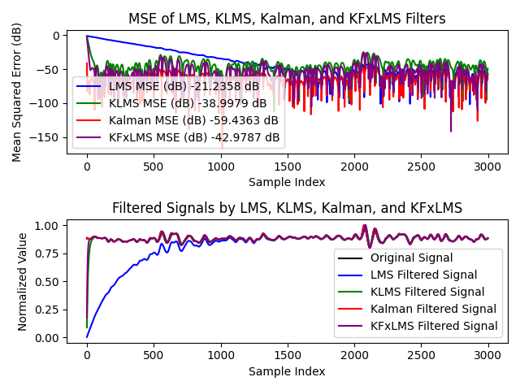

### README

## Análise Comparativa de Filtros: LMS, KLMS, Kalman e KFxLMS

Este documento apresenta uma análise comparativa de quatro filtros: LMS, KLMS, Kalman e KFxLMS. Os filtros foram aplicados a um sinal ruidoso, e seus desempenhos foram avaliados em termos de erro quadrático médio (MSE) ao longo do tempo e tempo de execução. As imagens geradas a partir dos resultados estão incluídas neste documento.

### Resultados

#### Imagem 1: MSE e Sinais Filtrados

A imagem acima mostra o erro quadrático médio (MSE) em decibéis (dB) ao longo do tempo para cada filtro, bem como os sinais filtrados.

- **LMS Filter**:
  - Cor: Azul
  - MSE médio após convergência: -21.2358 dB
  - Tempo de execução: - segundos

- **KLMS Filter**:
  - Cor: Verde
  - MSE médio após convergência: -38.9979 dB
  - Tempo de execução: 69 segundos

- **Kalman Filter**:
  - Cor: Vermelho
  - MSE médio após convergência: -59.4363 dB
  - Tempo de execução: - segundos

- **KFxLMS Filter**:
  - Cor: Roxo
  - MSE médio após convergência: -42.9787 dB
  - Tempo de execução: 104 segundos

#### Imagem 2: Tempos de Execução

A imagem acima mostra os tempos de execução dos quatro filtros. 

### Parâmetros Utilizados

| Filtro         | Parâmetros                                   |
|----------------|----------------------------------------------|
| **LMS**        | `learning_step=0.005`                        |
| **KLMS**       | `learning_step=0.1`, `sigma=0.4`             |
| **Kalman**     | `process_variance=1e-2`, `measurement_variance=0.01` |
| **KFxLMS**     | `learning_step=0.2`, `sigma=0.2`             |

### Análise dos Resultados

#### Convergência e Desempenho

1. **Kalman Filter**:
   - O filtro de Kalman teve a convergência mais rápida e o menor MSE médio após a convergência, o que o torna o mais eficiente entre os quatro filtros. 
   - A convergência rápida e eficiente do filtro de Kalman pode ser atribuída à sua capacidade de modelar processos lineares gaussianos com precisão, utilizando uma abordagem recursiva para atualização de estimativas.

2. **KLMS Filter**:
   - O filtro KLMS apresentou um bom desempenho em termos de MSE médio após a convergência, mas teve um tempo de execução significativamente mais longo em comparação com os filtros de Kalman e LMS.
   - Os filtros kernelizados, como o KLMS, são eficazes em lidar com dados não lineares mapeando-os para um espaço de características de alta dimensão, mas isso vem com um custo computacional mais alto.

3. **KFxLMS Filter**:
   - O filtro KFxLMS teve um desempenho intermediário em termos de MSE, mas também apresentou um tempo de execução longo.
   - Similar ao KLMS, o KFxLMS é adequado para aplicações não lineares, mas a complexidade adicional resulta em maior tempo de processamento.

4. **LMS Filter**:
   - O filtro LMS teve a menor eficiência em termos de MSE, mas seu tempo de execução foi relativamente curto.
   - O filtro LMS é adequado para sistemas lineares e de baixa complexidade, onde a velocidade de processamento é mais crítica do que a precisão da filtragem.

### Aplicações dos Filtros Kernelizados

Os filtros kernelizados, como KLMS e KFxLMS, são aplicáveis em cenários onde a relação entre as entradas e saídas não é linear. Exemplos incluem:

- **Processamento de Imagens**: Melhorar a qualidade da imagem ou remover ruído em imagens complexas.
- **Reconhecimento de Padrões**: Identificação de padrões em dados complexos onde os métodos lineares falham.
- **Previsão de Séries Temporais Não Lineares**: Modelagem de séries temporais com comportamento não linear.

### Aplicação em uma Caneta Auto Estabilizadora

#### Contexto

Os filtros kernelizados podem ser particularmente eficazes em uma caneta auto estabilizadora projetada para ajudar pessoas com Parkinson a escrever de maneira mais estável. Essa caneta utilizaria motores e acelerômetros para compensar os tremores da mão, estabilizando a ponta da caneta.

#### Vantagens dos Filtros Kernelizados

1. **Modelagem Não Linear**:
   - Os tremores das mãos de pessoas com Parkinson não seguem um padrão linear simples. Filtros kernelizados como o KLMS e o KFxLMS podem modelar essa relação não linear entre os sinais do acelerômetro e os ajustes necessários nos motores, proporcionando uma compensação mais precisa e eficaz.

2. **Adaptação Dinâmica**:
   - Filtros kernelizados podem se adaptar dinamicamente às mudanças nas características dos tremores, ajustando continuamente o controle do motor para manter a estabilidade da caneta.

3. **Robustez Contra Ruídos**:
   - Esses filtros são eficazes na filtragem de ruídos não lineares que podem estar presentes nos sinais do acelerômetro, resultando em um controle mais suave e estável.

#### Estudo e Prototipagem

Um estudo avaliando a aplicação de filtros kernelizados em um protótipo de caneta auto estabilizadora seria interessante porque:

- **Validação Experimental**:
  - Validar experimentalmente a eficácia dos filtros kernelizados na estabilização da caneta em comparação com filtros lineares como o Kalman.

- **Desenvolvimento de Algoritmos**:
  - Desenvolver algoritmos específicos para a compensação dos tremores, otimizando a resposta da caneta em diferentes condições de tremor.

- **Melhorias no Código**:
  - **Paralelização**: Implementar técnicas de paralelização para reduzir o tempo de execução dos filtros kernelizados.
  - **Otimização de Parâmetros**: Ajustar parâmetros como `sigma` e `learning_step` para encontrar o balanço ideal entre precisão e tempo de execução.
  - **Uso de GPUs**: Utilizar GPUs para acelerar o processamento dos filtros kernelizados, que são computacionalmente intensivos.

### Conclusão

Esta análise destaca os trade-offs entre precisão, tempo de execução e aplicabilidade dos diferentes filtros. O filtro de Kalman se destaca pela sua eficiência em sistemas lineares, enquanto os filtros kernelizados são mais adequados para aplicações não lineares, apesar de seu maior custo computacional. No contexto de uma caneta auto estabilizadora para pessoas com Parkinson, filtros kernelizados podem oferecer vantagens significativas em termos de precisão e adaptação dinâmica, justificando estudos e prototipagem adicionais para explorar seu potencial.

---

### Referências
- [----]()

---