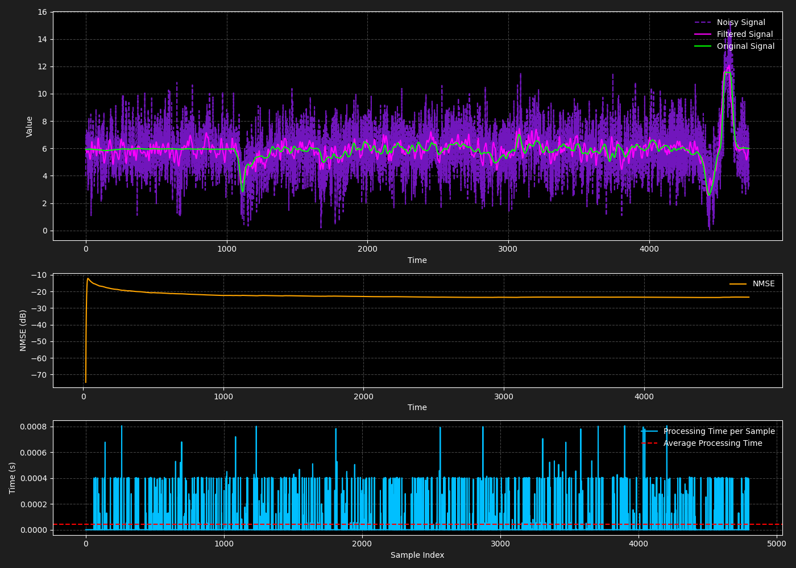

# Algoritmo de Kernel Filtered-x Least Mean Square (KFxLMS)

## (KFxLMS) -Pendente-

## Melhor resultado KFLMS (Kernel Filtered Least Mean Squares)

obs:. como o Kernel usa a caracteristicas acumuladas do sinal para um sinal mutio grande ou de alta frequencia acaba se tornado ineficiente se não for usado uma janela deslizante para não obrecarregar o algoritmo com muitos dados anterior que não necessariemnte irão influenciar a longo prazo. a variação é de 150in/s para 30in/s - errata o novo modelo otimizado inclui a melhoria de desempenho e limitação de memoria do kernel

## Melhor resultado Kalman (usado para estudos)
A partir dos dados coletados na pesquisa SIBGRAPI, conseguimos verificar a aplicação de um ruído artificial em um sinal. Logo após, testamos o conceito de filtros de Kalman abordados para o processamento do sinal fazendo uso de pesos gerados por Febonacci.

## Descrição Geral Lógica

O principal objetivo do truque do kernel é transformar um problema não linear no conjunto X em um problema linear no espaço H. Então, podemos resolver o problema linear em H, que é uma tarefa relativamente fácil. A teoria dos espaços de Hilbert com núcleo reprodutivo (RKHS) assegura a existência de uma representação Φ : X → H : Φ(x) = kx que mapeia cada elemento de X para um elemento de H (kx ∈ H é chamado de função núcleo reprodutivo para o ponto x). A seguir, apresentamos a derivação do filtro adaptativo proposto baseado no algoritmo filtered-x LMS.

## Fórmulas e Funcionamento do Filtro

### Saída do Filtro

Para o vetor de entrada de N elementos $x(n) = [x(n), x(n - 1), ..., x(n - N + 1)]^T$ , a saída do filtro $y(n)$ pode ser expressa por:

$$y(n) = w^T(n)Φ(x(n))\space\space\space\space\space(1)$$

onde $w^T(n)$ representa o vetor de pesos na n-ésima iteração.

### Ruído Residual

O ruído residual $e(n)$ detectado pelo microfone de erro é expresso como:

$$e(n) = d(n) - s(n) * y(n)\space\space\space\space\space(2)$$ 

onde $d(n)$ é o sinal de ruído de referência no ponto de cancelamento, $*$ denota a operação de convolução, e $s(n)$ é a resposta ao impulso do caminho secundário $S(z)$:

$$S(z) = \sum_{j=0}^{M-1} s_j z^{-j}$$

Substituindo (1) em (2), obtemos:

$$e(n) = d(n) - s(n) * [w^T(n)Φ(x(n))]$$

### Função de Custo

Baseado no critério do menor quadrado médio, a função de custo do algoritmo KFxLMS pode ser definida como a potência do ruído residual:

$$\xi = E[e^2(n)]$$

### Atualização dos Pesos

De acordo com o método de descida do gradiente, a equação de atualização dos pesos pode ser representada como:

$$w(n + 1) = w(n) - \frac{\mu}{2} \hat{\nabla}(n)$$

onde $\hat{\nabla}(n)$ é uma estimativa instantânea do gradiente de ξ com relação ao vetor de pesos $w(n)$:

$$\hat{\nabla}(n) = -2e(n) \frac{\partial y(n)}{\partial w(n)}$$

### Aproximação da Convolução no Espaço de Características

A computação de $\Phi(x(n)) * s(n)$ pode ser aproximada como:

$$\Phi(x(n)) * s(n) \approx \Phi(x(n) * s(n))$$

### Equação de Atualização Aproximada dos Pesos

Com base na dedução matemática acima, a atualização do vetor de pesos pode ser realizada por:

$$w(n + 1) = w(n) + \mu e(n) \Phi(x(n) * s(n))$$

### Kernel Gaussiano

A função de kernel Gaussiano é amplamente utilizada devido à sua capacidade de aproximação generalizada:

$$K(x, y) = \exp(-\eta \| x - y \|^2)$$

onde η é o parâmetro do kernel, que afeta a velocidade de convergência e o desempenho em regime permanente.

### Complexidade Computacional

A complexidade computacional do algoritmo KFxLMS é O(n). Embora a computação não seja tão eficiente quanto a dos algoritmos VFxLMS e FsLMS, a capacidade total do filtro adaptativo kernel em modelagem não linear é demonstrada.

### Resultados de Simulação

Para ilustrar o desempenho do algoritmo KFxLMS, assumimos que o caminho primário do sistema ANC exibe distorção não linear, modelada por um polinômio de terceira ordem:

$$d(n) = t(n - 2) + 0.08 * t^2(n - 2) - 0.04 * t^3(n - 2)$$

onde t(n) é gerado pela convolução linear:

$$t(n) = x(n) * p(n)$$

## Conclusão

Este README fornece uma visão geral do funcionamento do algoritmo KFxLMS, incluindo as fórmulas principais e a descrição do método de atualização dos pesos. Para mais detalhes, consulte as referências apropriadas.

## Referências

1. Kernel Filtered-x LMS Algorithm for Active Noise Control System with Nonlinear Primary Path
